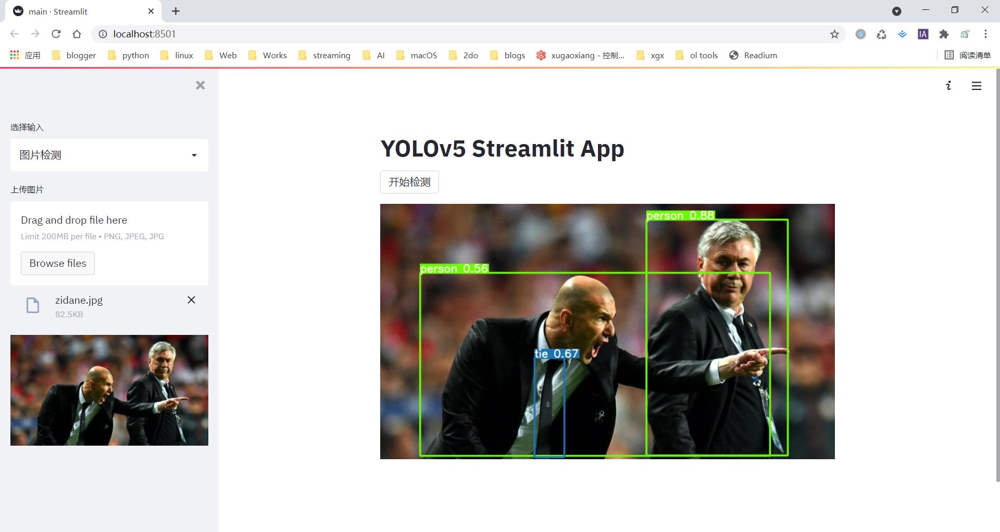

# yolov5-streamlit

Deploy [YOLOv5](https://github.com/ultralytics/yolov5/releases/tag/v5.0) detection with [Streamlit](https://github.com/streamlit/streamlit)

博文地址： <https://xugaoxiang.com/2021/08/27/yolov5-streamlit/>

# 线上体验

直接访问 <https://share.streamlit.io/xugaoxiang/yolov5-streamlit/main/main.py>

# 安装依赖

```
# For local installation, please opencv-python-headless 改为opencv-python
pip install -r requirements.txt
```

如果有`GPU`的话，将`torch`替换成`gpu`版本可加速检测

# run the project 运行项目

```
streamlit run main.py
```

**การตรวจจับภาพ**



**Video detection 视频检测**

